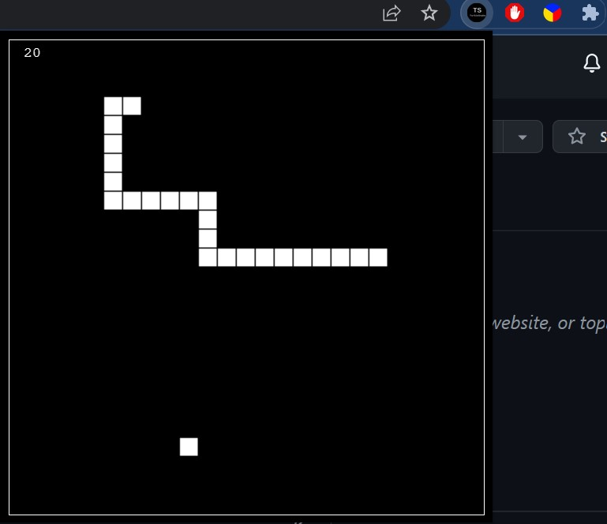

# Turbosnake Extension     

## Install instructions:
  **Manual install:**
  1. Unzip the snake_extension folder
  2. Go to chrome://extensions in your browser.
  3. Enable Developer mode.
  4. Click Load Unpacked and choose your folder.

<b>Chrome Web Store install:</b>
  https://chrome.google.com/webstore/detail/turbosnake/mgeaaaipkkglljdnjlmiidibkaaejlgb

